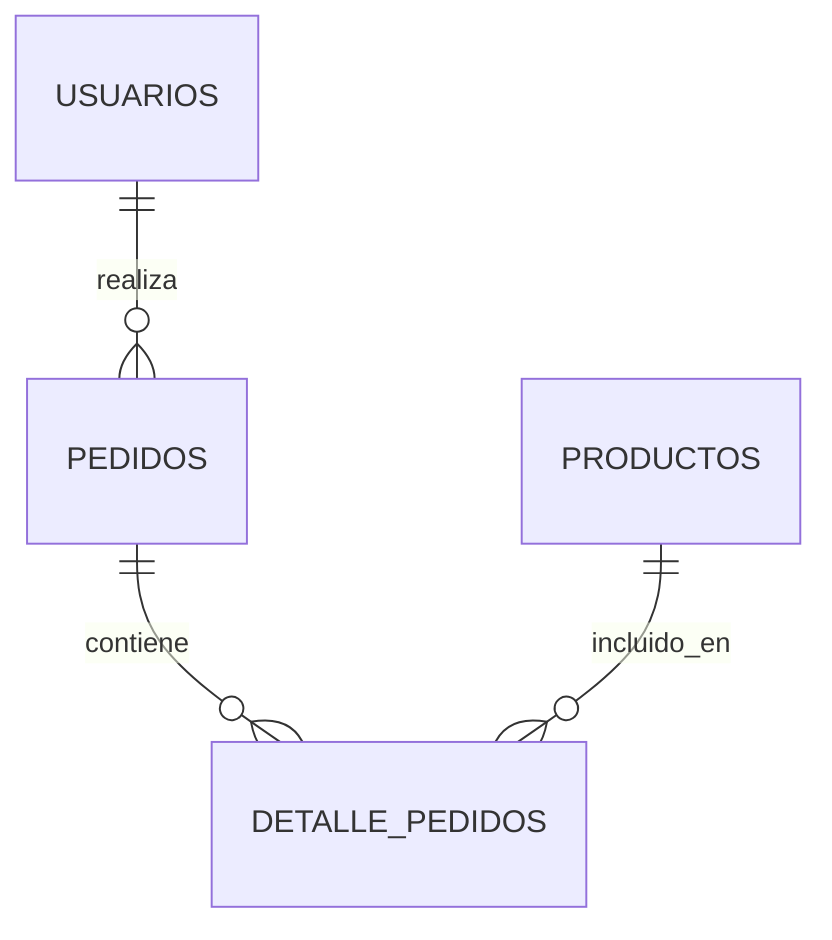

# Guía del Agente Oracle Analista

## Introducción

El **Agente Oracle Analista** es un agente inteligente construido con LangChain y Ollama que se conecta a bases de datos Oracle para realizar análisis de estructuras y generar documentación técnica.

**⚠️ MODO SOLO LECTURA**: Este agente está diseñado exclusivamente para análisis y documentación. NUNCA modifica datos ni estructuras.

## Características Principales

- **Conexión a Oracle**: Se conecta a bases de datos Oracle en modo de solo lectura
- **Exploración de esquemas**: Lista y analiza tablas, vistas y objetos
- **Análisis de estructura**: Describe columnas, tipos de datos, constraints
- **Mapeo de relaciones**: Identifica Foreign Keys y dependencias
- **Generación de diagramas**: Crea diagramas ER en formato Mermaid
- **Consulta de metadata**: Accede al diccionario de datos Oracle
- **100% Offline**: Usa modelos LLM locales (Ollama)

## Instalación y Configuración

### 1. Instalar Dependencias

```bash
# Activar entorno virtual (recomendado)
python -m venv venv
venv\Scripts\activate  # Windows

# Instalar dependencias
pip install -r UTILS/requirements_oracle.txt
```

### 2. Instalar Ollama

```bash
# Windows
winget install Ollama.Ollama

# Descargar modelo
ollama serve
ollama pull llama2
```

### 3. Configurar Conexión a Oracle

**Opción A: Script interactivo**
```bash
python SCRIPTS/configurar_oracle.py
```

**Opción B: Manual**

Crea el archivo `UTILS/config_oracle.py`:

```python
ORACLE_CONFIG = {
    'host': 'tu_host.ejemplo.com',
    'port': 1521,
    'service_name': 'tu_servicio',
    'user': 'tu_usuario',
    'password': 'tu_password'
}
```

**⚠️ IMPORTANTE**: El archivo `config_oracle.py` está en `.gitignore` para proteger tus credenciales.

## Herramientas Disponibles

### 1. ConectarOracle
**Propósito**: Establecer conexión con Oracle en modo de solo lectura

**Uso**:
```
Conéctate a la base de datos
```

**Resultado**: Confirmación de conexión exitosa

---

### 2. ListarTablas
**Propósito**: Obtener listado de todas las tablas del usuario

**Uso**:
```
Muéstrame todas las tablas
Lista las tablas del esquema
```

**Resultado**: Tabla con:
- Nombre de tabla
- Tablespace
- Número de filas
- Tipo (permanente/temporal)

---

### 3. DescribirTabla
**Propósito**: Obtener estructura detallada de una tabla

**Uso**:
```
Describe la tabla USUARIOS
Muéstrame la estructura de PEDIDOS
```

**Resultado**: Listado de columnas con:
- Nombre de columna
- Tipo de dato
- Longitud/Precisión
- Nullable (SÍ/NO)
- Valor por defecto

---

### 4. ObtenerRelaciones
**Propósito**: Identificar Foreign Keys entre tablas

**Uso**:
```
Muéstrame las relaciones de la tabla USUARIOS
¿Qué Foreign Keys hay?
```

**Resultado**: Lista de relaciones:
- Tabla origen → Tabla destino
- Columnas involucradas
- Nombre del constraint

---

### 5. ObtenerIndices
**Propósito**: Listar índices de una tabla

**Uso**:
```
Muéstrame los índices de USUARIOS
¿Qué índices tiene la tabla PEDIDOS?
```

**Resultado**: Lista de índices con:
- Nombre del índice
- Tipo (NORMAL, BITMAP, etc.)
- Uniqueness (UNIQUE/NORMAL)
- Columnas incluidas

---

### 6. GenerarDiagramaER
**Propósito**: Crear diagrama entidad-relación en formato Mermaid

**Uso**:
```
Genera un diagrama ER
Crea un diagrama de las tablas relacionadas con usuarios
```

**Resultado**: Código Mermaid que puede renderizarse como diagrama

**Ejemplo de salida**:


---

### 7. ConsultarMetadata
**Propósito**: Consultar información del diccionario de datos Oracle

**Uso**:
```
Muéstrame las vistas
Lista las secuencias
¿Qué triggers hay?
```

**Opciones disponibles**:
- `vistas`: USER_VIEWS
- `secuencias`: USER_SEQUENCES
- `triggers`: USER_TRIGGERS
- `procedimientos`: USER_OBJECTS (procedures, functions, packages)

---

## Flujo de Trabajo Típico

### Exploración Inicial

```
1. Tú: Conéctate a la base de datos
   Agente: ✅ Conectado a Oracle...

2. Tú: Muéstrame todas las tablas
   Agente: 📊 Encontradas 25 tablas: [lista...]

3. Tú: Describe la tabla USUARIOS
   Agente: 🔍 Estructura de USUARIOS: [columnas...]
```

### Análisis de Relaciones

```
4. Tú: Muéstrame las relaciones de USUARIOS
   Agente: 🔗 Relaciones encontradas:
           PEDIDOS.usuario_id → USUARIOS.id
           SESIONES.usuario_id → USUARIOS.id

5. Tú: Genera un diagrama ER de las tablas USUARIOS, PEDIDOS y PRODUCTOS
   Agente: 📈 [Código Mermaid del diagrama]
```

### Análisis de Metadata

```
6. Tú: ¿Qué índices tiene USUARIOS?
   Agente: 📇 Índices de USUARIOS:
           ✓ UNIQUE - PK_USUARIOS (id)
           Normal - IDX_USERNAME (username)

7. Tú: Muéstrame las secuencias
   Agente: 📋 SECUENCIAS encontradas: [lista...]
```

## Ejemplos de Uso

### Ejemplo 1: Análisis Completo de una Tabla

```
Tú: Conéctate a Oracle
Agente: ✅ Conectado

Tú: Analiza completamente la tabla USUARIOS: estructura, índices y relaciones
Agente: [El agente ejecutará automáticamente:]
        1. DescribirTabla USUARIOS
        2. ObtenerIndices USUARIOS
        3. ObtenerRelaciones USUARIOS
        [Y proporcionará un resumen completo]
```

### Ejemplo 2: Mapeo de Módulo Completo

```
Tú: Necesito documentar el módulo de pedidos. Muéstrame:
     - Todas las tablas que empiecen con PED
     - Sus relaciones
     - Un diagrama ER

Agente: [Ejecutará:]
        1. ListarTablas (filtrando por PED%)
        2. DescribirTabla para cada tabla encontrada
        3. ObtenerRelaciones del grupo
        4. GenerarDiagramaER con las tablas relacionadas
```

### Ejemplo 3: Auditoría de Estructura

```
Tú: ¿Qué tablas no tienen primary key?
Agente: [Consultará metadata y listará tablas sin PK]

Tú: ¿Qué tablas tienen triggers?
Agente: [Usará ConsultarMetadata para listar triggers]
```

## Vistas del Diccionario Oracle Utilizadas

El agente consulta estas vistas del diccionario de datos:

### Tablas y Columnas
- `USER_TABLES`: Información de tablas del usuario
- `USER_TAB_COLUMNS`: Columnas de las tablas
- `USER_TAB_COMMENTS`: Comentarios de tablas
- `USER_COL_COMMENTS`: Comentarios de columnas

### Constraints e Índices
- `USER_CONSTRAINTS`: Todas las constraints (PK, FK, UK, CHECK)
- `USER_CONS_COLUMNS`: Columnas en cada constraint
- `USER_INDEXES`: Índices definidos
- `USER_IND_COLUMNS`: Columnas de cada índice

### Objetos del Esquema
- `USER_VIEWS`: Definiciones de vistas
- `USER_SEQUENCES`: Secuencias del usuario
- `USER_TRIGGERS`: Triggers del usuario
- `USER_OBJECTS`: Todos los objetos (procedures, functions, packages)
- `USER_DEPENDENCIES`: Dependencias entre objetos

## Seguridad y Restricciones

### Comandos Permitidos
✅ **SOLO** consultas SELECT sobre:
- Vistas del diccionario (USER_*, ALL_*, DBA_*)
- Metadata de tablas, columnas, constraints, índices

### Comandos Prohibidos
🚫 **NUNCA** se ejecutarán:
- DML: INSERT, UPDATE, DELETE, MERGE
- DDL: CREATE, ALTER, DROP, TRUNCATE
- DCL: GRANT, REVOKE
- TCL: COMMIT, ROLLBACK (salvo el inicial READ ONLY)

**Mecanismo de protección**:
1. Conexión configurada como `READ ONLY` al conectar
2. Validación de comandos prohibidos antes de ejecutar queries
3. Si se detecta un comando prohibido, se rechaza inmediatamente

## Arquitectura del Agente

```
┌─────────────────────────────────────────────────────────┐
│                    AGENTE ORACLE                        │
│                  (LangChain + Ollama)                   │
└────────────────────┬────────────────────────────────────┘
                     │
                     │ Usa 7 herramientas
                     │
        ┌────────────┴────────────┐
        │                         │
┌───────▼────────┐     ┌─────────▼──────────┐
│  OracleDB      │     │  Diccionario       │
│  Connection    │     │  de Datos Oracle   │
│  (READ ONLY)   │     │  (USER_* views)    │
└────────────────┘     └────────────────────┘
        │
        │ Queries SELECT
        │
┌───────▼──────────────────────────────────────┐
│   Base de Datos Oracle                       │
│   (indudescs.bd.gva.es:1528/indudes)        │
└──────────────────────────────────────────────┘
```

## Configuración Avanzada

### Cambiar Modelo de Ollama

Edita `AGENTS/agente_oracle.py` línea 115:

```python
llm = Ollama(
    model="mistral",  # Cambia aquí: llama2, mistral, codellama, etc.
    temperature=0.3,
)
```

### Ajustar Verbosidad

Línea 193:

```python
agente_executor = AgentExecutor(
    agent=agente,
    tools=herramientas,
    verbose=False,  # False = menos output, True = ver razonamiento
    ...
)
```

### Agregar Más Herramientas

Puedes agregar herramientas personalizadas en `agente_oracle.py`:

```python
def analizar_performance(tabla: str) -> str:
    """Analiza estadísticas de performance de una tabla."""
    query = f"""
        SELECT table_name, num_rows, blocks, avg_row_len
        FROM user_tables
        WHERE table_name = :tabla
    """
    # ... implementación

# Agregar a la lista de herramientas
Tool(
    name="AnalizarPerformance",
    func=analizar_performance,
    description="Analiza estadísticas de performance. Entrada: nombre de tabla"
)
```

## Troubleshooting

### Error: "No module named 'oracledb'"

```bash
pip install oracledb
```

### Error: "Connection refused" o "TNS: listener does not currently know of service"

1. Verifica que el host sea accesible:
   ```bash
   ping indudescs.bd.gva.es
   ```

2. Verifica puerto y servicio en `config_oracle.py`

3. Prueba conexión con cliente Oracle (sqlplus, SQL Developer)

### Error: "ORA-01017: invalid username/password"

Verifica credenciales en `UTILS/config_oracle.py`

### Error: "Ollama not running"

```bash
ollama serve
```

En otra terminal:
```bash
ollama pull llama2
```

### El agente no entiende las preguntas

1. Prueba con un modelo más potente:
   ```bash
   ollama pull mistral
   ```

2. Sé más específico en las preguntas:
   - ❌ "Dime cosas"
   - ✅ "Lista todas las tablas"

## Mejores Prácticas

### 1. Exploración Progresiva
- Empieza listando tablas
- Luego describe las que te interesan
- Finalmente genera diagramas

### 2. Diagramas Enfocados
- Limita diagramas a 8-10 tablas
- Agrupa por módulo funcional
- Genera múltiples diagramas en lugar de uno gigante

### 3. Nomenclatura Consistente
- Usa nombres de tablas en MAYÚSCULAS
- Oracle es case-insensitive pero guarda en MAYÚSCULAS

### 4. Guardar Resultados
- Copia diagramas Mermaid a archivos .md
- Documenta hallazgos en archivos separados
- Usa OUTPUT/ para guardar documentación generada

## Próximos Pasos

### Extensiones Posibles

1. **Exportar a formato específico**
   - Generar Excel con estructura de tablas
   - Exportar diagramas como imágenes (PNG/SVG)

2. **Análisis de Performance**
   - Consultar USER_TAB_STATISTICS
   - Identificar tablas sin índices
   - Sugerir optimizaciones

3. **Documentación Automática**
   - Generar Markdown completo de esquema
   - Crear diccionario de datos
   - Documentar dependencias entre objetos

4. **Integración con otras herramientas**
   - Exportar a diagramas.net (Draw.io)
   - Integrar con ERD tools
   - Generar scripts DDL

## Recursos Adicionales

### Documentación Oracle
- [Oracle Database Documentation](https://docs.oracle.com/en/database/)
- [Data Dictionary Views](https://docs.oracle.com/en/database/oracle/oracle-database/19/refrn/about-static-data-dictionary-views.html)

### LangChain
- [LangChain Documentation](https://python.langchain.com/)
- [Creating Custom Tools](https://python.langchain.com/docs/modules/agents/tools/)

### Ollama
- [Ollama Models](https://ollama.com/library)
- [Ollama Documentation](https://github.com/ollama/ollama)

### Mermaid
- [Mermaid Live Editor](https://mermaid.live/)
- [ER Diagram Syntax](https://mermaid.js.org/syntax/entityRelationshipDiagram.html)

---

**Versión**: 1.0
**Fecha**: 2025-11-17
**Autor**: Sistema de Agentes LangChain
**Entorno**: Windows + Oracle + Ollama
